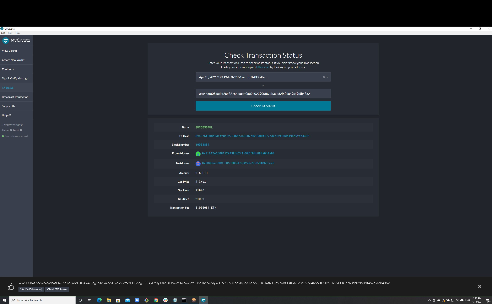
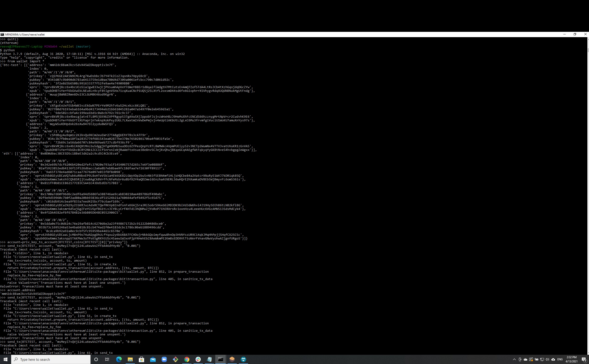

# TEST TRANSACTIONS

## Description
This wallet was built with python and works on the terminal running python commands.

Unfortunately, the BTCTest faucet was not funding any of my addresses so I could not send a transaction between BTCTEST addresses. This can be seen in the terminal screenshot.

I was able to fund my ETH addresses on the Ropstein Testnet.

## Lines of code used

import os
import subprocess
import json
from constants import BTC, BTCTEST, ETH
from dotenv import load_dotenv 
from pprint import pprint
load_dotenv()
from bit import PrivateKeyTestnet
from web3 import Account, Web3
w3 = Web3(Web3.HTTPProvider("http://localhost:8545"))
from bit.network import NetworkAPI
from web3.middleware import get_poa_middleware
w3.middleware_onion.inject(geth_poa_Middleware, layer=0)

def derive_wallets(coin): 
    #keys = json.loads(output)
    #print(keys)
    MNEMONIC = os.getenv("HW_MNEMONIC_KEY")
    COIN = coin
    DEPTH = 3
    command = f'php ./hd-wallet-derive/hd-wallet-derive.php -g --mnemonic="{MNEMONIC}" --cols=all --coin={COIN} --numderive={DEPTH} --format=json'

    p = subprocess.Popen(command, stdout=subprocess.PIPE, shell=True)
    (output, err) = p.communicate()
    p_status = p.wait()
    return json.loads(output)

#print(coins[BTCTEST][0]['privkey'])

def priv_key_to_account(coin, priv_key):
    if coin==ETH: 
        # do something
        return Account.privateKeyToAccount(priv_key)
    elif coin==BTCTEST: 
        # do something else
        return PrivateKeyTestnet(priv_key)
        

def create_tx(coin, account, to, amount):
    if coin==ETH: 
        # do something
        return {'to': to,
               'from': account,
               'value': w3.toWei(amount, "ether"),
               'gas': w3.eth.estimateGas({"to": to, "from": account, "amount": value}),
               'gasPrice': w3.eth.generateGasPrice(),
               'nonce': w3.eth.getTransactionCount(account),
               'chainID': w3.eth.chainID}
    elif coin==BTCTEST: 
        # do something else
        return PrivateKeyTestnet.prepare_transaction(account.address, [(to, amount, BTC)])
    
def send_tx(coin, account, to, amount): 
    
    if coin==ETH: 
        
        raw_tx=create_tx(coin, account.address, to, amount)
        signed=account.signTransaction(raw_tx)
        return w3.eth.sendRawTransaction(signed.rawTransaction)
    elif coin==BTCTEST: 
        raw_tx=create_tx(coin, account, to, amount)
        signed=account.signTransaction(raw_tx)
        return NetworkAPI.broadcast_tx_testnet(signed)
    
coins={ETH: derive_wallets(ETH), 
       BTCTEST: derive_wallets(BTCTEST)}
